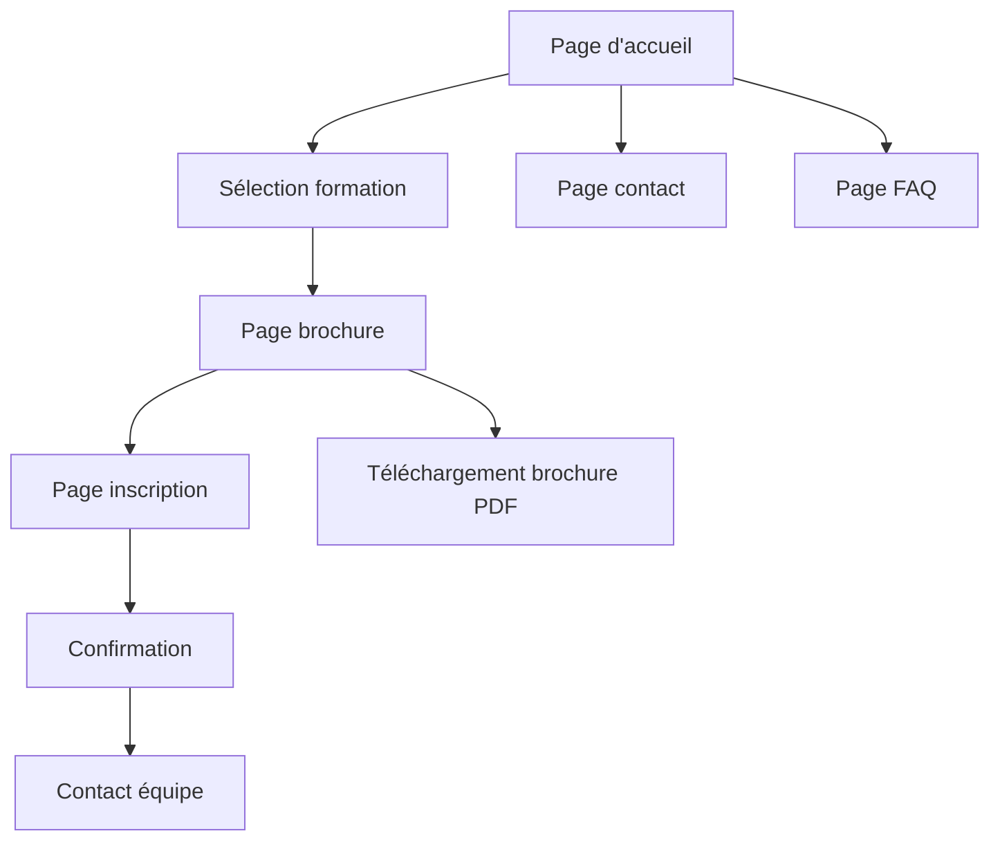

# Document de Spécifications Produit - Flyness Training

## 1. Vue d'ensemble du produit

Plateforme web complète pour Flyness Training, centre de formation aéroportuaire spécialisé dans la sûreté, l'APMR et l'anglais aéroportuaire. <mcreference link="https://www.flynesstraining.com/" index="1">1</mcreference> Le site doit présenter toutes les formations disponibles avec des pages de brochures détaillées et des formulaires d'inscription intégrés. <mcreference link="https://www.flynesstraining.com/formation-apmr" index="1">1</mcreference>

Le produit vise à digitaliser le processus d'inscription aux formations et à fournir une présentation professionnelle de l'offre de formation pour attirer de nouveaux stagiaires dans le secteur aéroportuaire.

## 2. Fonctionnalités principales

### 2.1 Rôles utilisateurs

| Rôle | Méthode d'inscription | Permissions principales |
|------|----------------------|------------------------|
| Visiteur | Accès libre | Consulter les formations, télécharger les brochures |
| Candidat | Formulaire d'inscription | S'inscrire aux formations, suivre sa candidature |
| Administrateur | Accès backend | Gérer les inscriptions, modifier le contenu |

### 2.2 Modules de fonctionnalités

Notre plateforme comprend les pages principales suivantes :
1. **Page d'accueil** : présentation générale, navigation vers les formations, témoignages
2. **Pages de brochures** : détails complets pour chaque formation avec programmes et tarifs
3. **Pages d'inscription** : formulaires spécifiques à chaque formation
4. **Page de contact** : informations de contact et localisation
5. **Page FAQ** : questions fréquentes sur les formations et certifications

### 2.3 Détails des pages

| Nom de la page | Module | Description des fonctionnalités |
|----------------|--------|----------------------------------|
| Accueil | Section héro | Présentation de Flyness Training, navigation principale, call-to-action vers les formations |
| Accueil | Liste des formations | Aperçu de toutes les formations avec liens vers les brochures |
| Accueil | Témoignages | Affichage des avis clients et taux de réussite |
| Brochure APMR | Détails formation | Programme complet, durée 70h, tarif 1450€, prérequis, objectifs pédagogiques |
| Brochure TFP ASA T7 | Détails formation | Programme 150h, tarif 2550€, modules sûreté et sécurité, certification |
| Brochure TFP ASA T10 | Détails formation | Programme 210h, tarif 2950€, formation complète agent de sûreté |
| Brochure RVS T10 | Détails formation | Formation révision 12h, tarif 360€, changement de typologie |
| Brochure FPI | Détails formation | Formation périodique imagerie, tarif 140€, maintien des compétences |
| Brochure SST | Détails formation | Sauveteur Secouriste du Travail, prévention des risques |
| Brochure Anglais | Détails formation | Anglais aéroportuaire, communication professionnelle |
| Inscription APMR | Formulaire | Collecte des informations personnelles, motivation, disponibilités |
| Inscription TFP ASA | Formulaire | Vérification des prérequis, pièces justificatives, planning |
| Inscription formations courtes | Formulaire | Inscription simplifiée pour RVS, FPI, SST |
| Contact | Informations | Adresse, téléphone, email, horaires d'ouverture |
| FAQ | Questions-réponses | Informations sur les certifications, salaires, évolutions de carrière |

## 3. Processus principal

**Parcours visiteur :**
Le visiteur arrive sur la page d'accueil, découvre les formations disponibles, consulte les brochures détaillées, puis procède à l'inscription via le formulaire approprié. Après soumission, il reçoit une confirmation et est contacté par l'équipe pédagogique.

**Parcours administrateur :**
L'administrateur accède au backend pour gérer les inscriptions reçues, modifier le contenu des formations, et suivre les statistiques d'inscription.

## 4. Design de l'interface utilisateur

### 4.1 Style de design

- **Couleurs principales :** Bleu aéronautique (#003366), blanc (#FFFFFF)
- **Couleurs secondaires :** Orange accent (#FF6B35), gris clair (#F5F5F5)
- **Style des boutons :** Boutons arrondis avec effet hover, style moderne
- **Police :** Roboto pour les titres, Open Sans pour le texte
- **Tailles de police :** H1: 32px, H2: 24px, H3: 20px, Corps: 16px
- **Style de mise en page :** Design en cartes, navigation supérieure fixe
- **Icônes :** Style moderne et minimaliste, icônes d'avion et aéroport

### 4.2 Aperçu du design des pages

| Nom de la page | Module | Éléments UI |
|----------------|--------|-------------|
| Accueil | Section héro | Image d'arrière-plan aéroportuaire, titre principal, bouton CTA "Découvrir nos formations" |
| Accueil | Grille formations | Cartes avec images, titres, durées, prix, boutons "En savoir plus" |
| Brochures | En-tête formation | Titre, durée, prix, niveau, bouton d'inscription prominent |
| Brochures | Programme détaillé | Accordéon avec modules, objectifs, méthodes pédagogiques |
| Brochures | Prérequis | Liste à puces avec icônes, conditions d'admission |
| Inscription | Formulaire | Champs structurés, validation en temps réel, barre de progression |
| Inscription | Récapitulatif | Résumé de la formation choisie, conditions générales |

### 4.3 Responsivité

Le site est conçu mobile-first avec adaptation desktop. Optimisation tactile pour les formulaires d'inscription sur mobile. Navigation hamburger sur mobile, menu horizontal sur desktop.

## 5. Formations détaillées

### 5.1 Formation APMR (Accompagnement Personnes à Mobilité Réduite)
- **Durée :** 70 heures
- **Tarif :** 1 450€
- **Effectif :** 12 stagiaires maximum
- **Prérequis :** Savoir lire et écrire le français, casier judiciaire vierge
- **Programme :** Théorie et pratique APMR, sûreté aéroportuaire, marchandises dangereuses, sécurité sur piste, SST, anglais

### 5.2 Formation TFP ASA T7 (Agent de Sûreté Aéroportuaire Typologie 7)
- **Durée :** 150 heures
- **Tarif :** 2 550€
- **Effectif :** 12 stagiaires maximum
- **Prérequis :** 18 ans minimum, niveau BEP/CAP, nationalité UE, casier judiciaire vierge
- **Programme :** Modules sûreté (inspection filtrage, équipements RX/EDS/ETD), modules sécurité (SST, environnement juridique)

### 5.3 Formation TFP ASA T10 (Agent de Sûreté Aéroportuaire Typologie 10)
- **Durée :** 210 heures
- **Tarif :** 2 950€
- **Effectif :** 12 stagiaires maximum
- **Prérequis :** Identiques à T7
- **Programme :** Formation complète incluant tous les modules T7 plus fret et véhicules

### 5.4 Formation RVS T10 (Révision Typologie 10)
- **Durée :** 12 heures
- **Tarif :** 360€
- **Public :** Agents souhaitant changer de typologie
- **Programme :** Révisions théorie et pratique, imagerie sur simulateur LOGYx

### 5.5 Formation Périodique Imagerie (FPI)
- **Durée :** Variable selon typologie
- **Tarif :** 140€
- **Fréquence :** Semestrielle obligatoire
- **Programme :** Imagerie et pratique sur simulateur LOGYx

### 5.6 Formation SST (Sauveteur Secouriste du Travail)
- **Objectif :** Intervenir efficacement en cas d'accident, prévention des risques
- **Intégration :** Module inclus dans les formations TFP ASA

### 5.7 Formation Anglais Aéroportuaire
- **Objectif :** Communication claire et sécurisée en environnement aéroportuaire
- **Public :** Personnel aéroportuaire, agents d'escale, sécurité
- **Contenu :** Vocabulaire technique, situations professionnelles