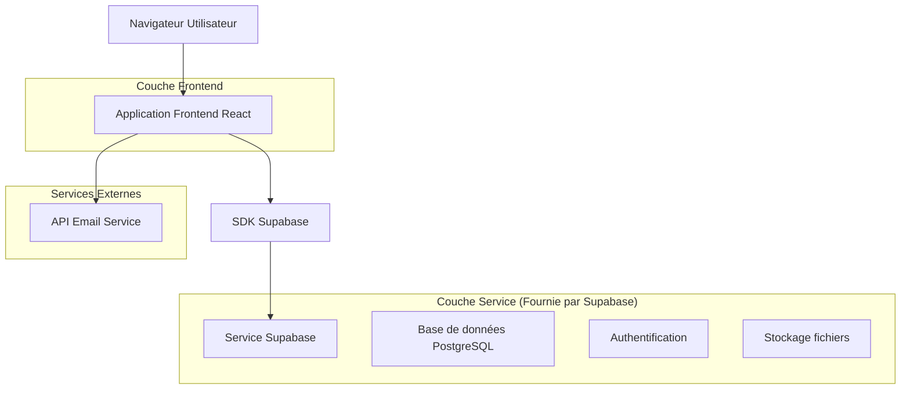
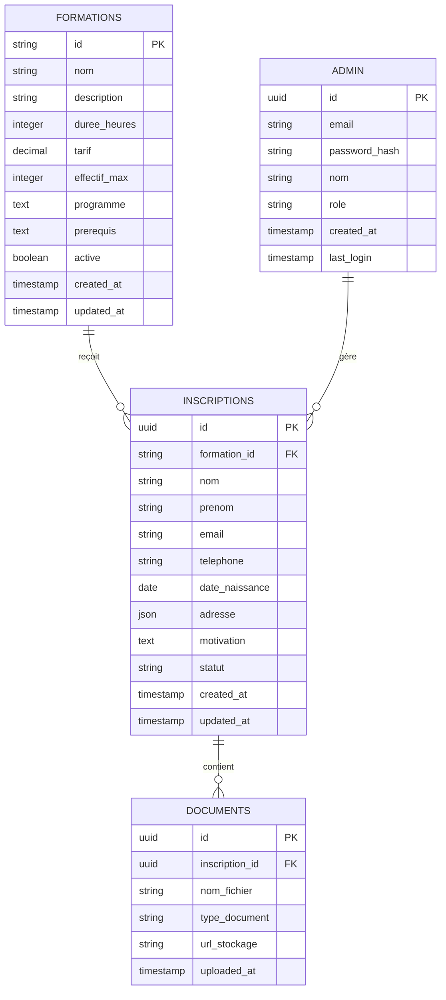

# Document d'Architecture Technique - Flyness Training

## 1. Conception de l'architecture



## 2. Description des technologies

* **Frontend :** React\@18 + TypeScript + Tailwind CSS\@3 + Next.js\@14

* **Backend :** Supabase (BaaS)

* **Base de données :** Supabase PostgreSQL

* **Authentification :** Supabase Auth

* **Stockage :** Supabase Storage (pour les brochures PDF)

* **Email :** Service d'email intégré ou API externe

## 3. Définitions des routes

| Route                    | Objectif                                                                    |
| ------------------------ | --------------------------------------------------------------------------- |
| /                        | Page d'accueil avec présentation générale et navigation vers les formations |
| /formations              | Page listant toutes les formations disponibles                              |
| /formation/apmr          | Page brochure détaillée pour la formation APMR                              |
| /formation/tfp-asa-t7    | Page brochure pour la formation TFP ASA T7                                  |
| /formation/tfp-asa-t10   | Page brochure pour la formation TFP ASA T10                                 |
| /formation/rvs-t10       | Page brochure pour la formation RVS T10                                     |
| /formation/fpi           | Page brochure pour la Formation Périodique Imagerie                         |
| /formation/sst           | Page brochure pour la formation SST                                         |
| /formation/anglais       | Page brochure pour la formation Anglais Aéroportuaire                       |
| /inscription/apmr        | Formulaire d'inscription pour APMR                                          |
| /inscription/tfp-asa-t7  | Formulaire d'inscription pour TFP ASA T7                                    |
| /inscription/tfp-asa-t10 | Formulaire d'inscription pour TFP ASA T10                                   |
| /inscription/rvs-t10     | Formulaire d'inscription pour RVS T10                                       |
| /inscription/fpi         | Formulaire d'inscription pour FPI                                           |
| /inscription/sst         | Formulaire d'inscription pour SST                                           |
| /inscription/anglais     | Formulaire d'inscription pour Anglais                                       |
| /contact                 | Page de contact avec informations et formulaire                             |
| /faq                     | Page FAQ avec questions fréquentes                                          |
| /admin                   | Interface d'administration pour gérer les inscriptions                      |
| /admin/login             | Page de connexion administrateur                                            |

## 4. Définitions des API

### 4.1 API principales

**Gestion des inscriptions**

```
POST /api/inscriptions
```

Requête :

| Nom du paramètre | Type   | Obligatoire | Description                 |
| ---------------- | ------ | ----------- | --------------------------- |
| formation\_id    | string | true        | Identifiant de la formation |
| nom              | string | true        | Nom du candidat             |
| prenom           | string | true        | Prénom du candidat          |
| email            | string | true        | Email du candidat           |
| telephone        | string | true        | Numéro de téléphone         |
| date\_naissance  | date   | true        | Date de naissance           |
| adresse          | object | true        | Adresse complète            |
| motivation       | string | false       | Lettre de motivation        |
| pieces\_jointes  | array  | false       | Documents justificatifs     |

Réponse :

| Nom du paramètre | Type    | Description                  |
| ---------------- | ------- | ---------------------------- |
| success          | boolean | Statut de la réponse         |
| inscription\_id  | string  | Identifiant de l'inscription |
| message          | string  | Message de confirmation      |

Exemple :

```json
{
  "formation_id": "apmr",
  "nom": "Dupont",
  "prenom": "Jean",
  "email": "jean.dupont@email.com",
  "telephone": "0123456789",
  "date_naissance": "1990-01-01",
  "adresse": {
    "rue": "123 rue de la Paix",
    "ville": "Paris",
    "code_postal": "75001"
  }
}
```

**Récupération des formations**

```
GET /api/formations
```

Réponse :

| Nom du paramètre | Type  | Description                      |
| ---------------- | ----- | -------------------------------- |
| formations       | array | Liste des formations disponibles |

**Authentification administrateur**

```
POST /api/auth/admin/login
```

Requête :

| Nom du paramètre | Type   | Obligatoire | Description          |
| ---------------- | ------ | ----------- | -------------------- |
| email            | string | true        | Email administrateur |
| password         | string | true        | Mot de passe         |

## 5. Modèle de données

### 5.1 Définition du modèle de données



### 5.2 Langage de Définition des Données (DDL)

**Table des formations (formations)**

```sql
-- Création de la table
CREATE TABLE formations (
    id VARCHAR(50) PRIMARY KEY,
    nom VARCHAR(200) NOT NULL,
    description TEXT,
    duree_heures INTEGER NOT NULL,
    tarif DECIMAL(10,2) NOT NULL,
    effectif_max INTEGER DEFAULT 12,
    programme TEXT,
    prerequis TEXT,
    active BOOLEAN DEFAULT true,
    created_at TIMESTAMP WITH TIME ZONE DEFAULT NOW(),
    updated_at TIMESTAMP WITH TIME ZONE DEFAULT NOW()
);

-- Données initiales
INSERT INTO formations (id, nom, description, duree_heures, tarif, programme, prerequis) VALUES
('apmr', 'Formation APMR', 'Accompagnement aux Personnes à Mobilité Réduite', 70, 1450.00, 'Théorie et pratique APMR, Sûreté aéroportuaire, Marchandises dangereuses, Sécurité sur piste, SST, Anglais', 'Savoir lire et écrire le français, Casier judiciaire vierge'),
('tfp-asa-t7', 'TFP ASA T7', 'Agent de Sûreté Aéroportuaire Typologie 7', 150, 2550.00, 'Modules sûreté et sécurité, Inspection filtrage, Équipements RX/EDS/ETD', 'Niveau BEP/CAP, 18 ans minimum, Nationalité UE'),
('tfp-asa-t10', 'TFP ASA T10', 'Agent de Sûreté Aéroportuaire Typologie 10', 210, 2950.00, 'Formation complète agent de sûreté, Tous modules T7 + fret et véhicules', 'Niveau BEP/CAP, 18 ans minimum, Nationalité UE'),
('rvs-t10', 'RVS T10', 'Révision Typologie 10', 12, 360.00, 'Révisions théorie et pratique, Imagerie sur simulateur LOGYx', 'TFP ASA, Certification à jour'),
('fpi', 'Formation Périodique Imagerie', 'Maintien des compétences imagerie', 4, 140.00, 'Imagerie et pratique sur simulateur LOGYx', 'TFP ASA, Certification à jour'),
('sst', 'Formation SST', 'Sauveteur Secouriste du Travail', 14, 250.00, 'Prévention des risques, Gestes de premiers secours', 'Aucun prérequis'),
('anglais', 'Anglais Aéroportuaire', 'Communication en anglais aéroportuaire', 30, 450.00, 'Vocabulaire technique, Situations professionnelles', 'Niveau débutant accepté');
```

**Table des inscriptions (inscriptions)**

```sql
-- Création de la table
CREATE TABLE inscriptions (
    id UUID PRIMARY KEY DEFAULT gen_random_uuid(),
    formation_id VARCHAR(50) REFERENCES formations(id),
    nom VARCHAR(100) NOT NULL,
    prenom VARCHAR(100) NOT NULL,
    email VARCHAR(255) NOT NULL,
    telephone VARCHAR(20) NOT NULL,
    date_naissance DATE NOT NULL,
    adresse JSONB NOT NULL,
    motivation TEXT,
    statut VARCHAR(20) DEFAULT 'en_attente' CHECK (statut IN ('en_attente', 'accepte', 'refuse', 'complete')),
    created_at TIMESTAMP WITH TIME ZONE DEFAULT NOW(),
    updated_at TIMESTAMP WITH TIME ZONE DEFAULT NOW()
);

-- Création des index
CREATE INDEX idx_inscriptions_formation_id ON inscriptions(formation_id);
CREATE INDEX idx_inscriptions_email ON inscriptions(email);
CREATE INDEX idx_inscriptions_statut ON inscriptions(statut);
CREATE INDEX idx_inscriptions_created_at ON inscriptions(created_at DESC);
```

**Table des documents (documents)**

```sql
-- Création de la table
CREATE TABLE documents (
    id UUID PRIMARY KEY DEFAULT gen_random_uuid(),
    inscription_id UUID REFERENCES inscriptions(id) ON DELETE CASCADE,
    nom_fichier VARCHAR(255) NOT NULL,
    type_document VARCHAR(50) NOT NULL,
    url_stockage VARCHAR(500) NOT NULL,
    uploaded_at TIMESTAMP WITH TIME ZONE DEFAULT NOW()
);

-- Création des index
CREATE INDEX idx_documents_inscription_id ON documents(inscription_id);
```

**Table des administrateurs (admin)**

```sql
-- Création de la table
CREATE TABLE admin (
    id UUID PRIMARY KEY DEFAULT gen_random_uuid(),
    email VARCHAR(255) UNIQUE NOT NULL,
    password_hash VARCHAR(255) NOT NULL,
    nom VARCHAR(100) NOT NULL,
    role VARCHAR(20) DEFAULT 'admin' CHECK (role IN ('admin', 'super_admin')),
    created_at TIMESTAMP WITH TIME ZONE DEFAULT NOW(),
    last_login TIMESTAMP WITH TIME ZONE
);

-- Données initiales (mot de passe à hasher)
INSERT INTO admin (email, password_hash, nom, role) VALUES
('admin@flynesstraining.com', '$2b$10$...', 'Administrateur', 'super_admin');
```

**Permissions Supabase**

```sql
-- Permissions pour les tables
GRANT SELECT ON formations TO anon;
GRANT INSERT ON inscriptions TO anon;
GRANT INSERT ON documents TO anon;

GRANT ALL PRIVILEGES ON formations TO authenticated;
GRANT ALL PRIVILEGES ON inscriptions TO authenticated;
GRANT ALL PRIVILEGES ON documents TO authenticated;
GRANT ALL PRIVILEGES ON admin TO authenticated;
```

## 6. Sécurité et validation

### 6.1 Validation des données

* Validation côté client avec React Hook Form

* Validation côté serveur avec Supabase RLS (Row Level Security)

* Sanitisation des entrées utilisateur

* Validation des formats email et téléphone

### 6.2 Sécurité des fichiers

* Upload sécurisé via Supabase Storage

* Limitation des types de fichiers (PDF, JPG, PNG)

* Limitation de la taille des fichiers (5MB max)

* Scan antivirus recommandé

### 6.3 Protection des données

* Chiffrement des données sensibles

* Conformité RGPD

* Politique de rétention des données

* Consentement explicite pour le traitement des données

